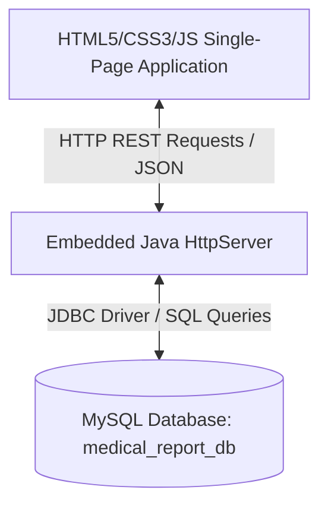
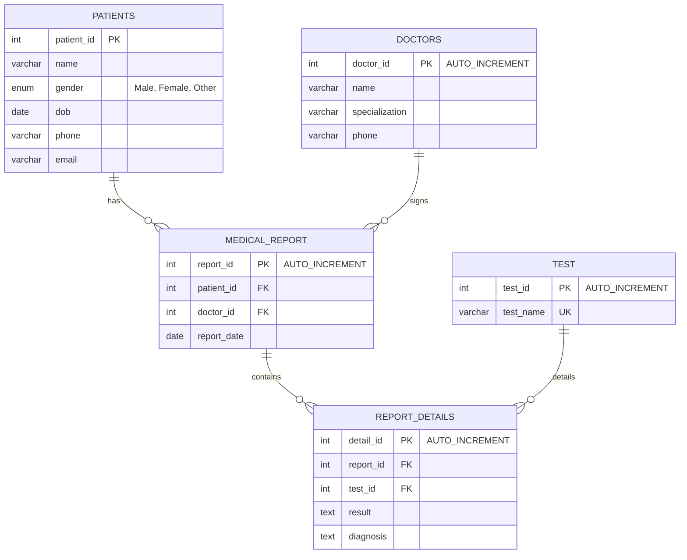

# AuraMed Diagnostics DBMS - Technical Project Report

This documentation provides a comprehensive analysis of the architecture, design choices, database schema, and implementation details for the AuraMed Diagnostics database management system (DBMS).

---

## 1. Project Architecture

The application is built using a **decoupled Client-Server Architecture** implemented inside a single project space.



### Why this architecture?
- **Separation of Concerns**: The user interface (Frontend) is completely isolated from the database query logic (Backend).
- **Embedded WebServer**: Instead of installing heavy server containers (like Apache Tomcat or WildFly) or building a large Spring Boot application, we used Java's built-in `com.sun.net.httpserver.HttpServer`. This keeps the project lightweight, portable, and allows it to compile and run instantly using a standard JDK.
- **Portability**: It uses your existing MySQL JDBC driver jar and runs directly from a simple script (`run.bat`).

---

## 2. Database Design (MySQL Schema)

The database, named `medical_report_db`, contains 5 tables structured in a relational database format.

### Database Tables & Relationships



### Table Columns and Explanations
1. **`Patients`**: Stores core patient information. The `gender` field is restricted to an `ENUM('Male', 'Female', 'Other')` to ensure database-level consistency.
2. **`Doctors`**: Contains doctor records. The `doctor_id` is an auto-incrementing key, making it easy to create new doctor profiles without manually specifying IDs.
3. **`Test`**: Contains unique, non-null lab test names (e.g. `X-Ray`, `ECG`, `Blood Test`).
4. **`Medical_Report`**: Acts as a bridge between a patient and a doctor, representing a single diagnostic visit on a particular date. It holds foreign keys referencing `Patients` and `Doctors`.
5. **`Report_Details`**: Represents the line items of a medical report. It links a specific `Medical_Report` to a diagnostic `Test` and records the resulting findings and diagnosis.

### SQL Database Validation Triggers
To enforce strict medical integrity and prevent faulty data entry, we implemented 5 distinct validation triggers:

| Trigger Name | Table | Timing | Description |
| :--- | :--- | :--- | :--- |
| `before_insert_patient` & `before_update_patient` | `Patients` | BEFORE | Prevents special characters in name. Validates phone number length (10-15 digits). Enforces a regex pattern on email address. Restricts DOB to today or past dates. |
| `before_insert_doctor` & `before_update_doctor` | `Doctors` | BEFORE | Validates doctor name and specialization structure. Restricts phone number to 10-15 digits. |
| `before_insert_medical_report` & `before_update_medical_report` | `Medical_Report` | BEFORE | Prevents report logging on future dates. |
| `before_insert_test` & `before_update_test` | `Test` | BEFORE | Restricts test names to alphanumeric characters and spaces only. |
| `before_insert_report_details` & `before_update_report_details` | `Report_Details` | BEFORE | Enforces that both test results and diagnosis fields cannot be empty or contain only whitespace. |

---

## 3. Data Access Object (DAO) Pattern

The application uses the **DAO Pattern** in Java.
- **Purpose**: It isolates the database access code (queries, connection management) from the HTTP API routing logic.
- **Classes**:
  - `DBConnection`: Handles loading the MySQL JDBC driver class (`com.mysql.cj.jdbc.Driver`) and establishing a connection using your credentials.
  - `PatientDAO`, `DoctorDAO`, `TestDAO`, `MedicalReportDAO`, `ReportDetailDAO`: Classes initialized with a `Connection` object. They handle SQL preparation (`PreparedStatement`), parameter binding, statement execution, and map `ResultSet` rows into model objects.

### Refactoring CLI to Web Services
In the original project, the DAOs prompted the console user for updates or deletes using Java's `Scanner`. 
To migrate this to a web-based DBMS, we refactored the DAOs:
- Decoupled terminal logic from the database methods.
- Added parameter-driven methods such as `updatePatientById(int id, Patient p)` and `deletePatientById(int id)` which return simple boolean states.
- Replaced internal catch blocks with `throws SQLException`, allowing trigger-raised database errors (via `SIGNAL SQLSTATE '45000'`) to float up to the HTTP layer.

---

## 4. Backend Server & REST API

The [WebServer.java](file:///E:/medical_report_db_project/src/WebServer.java) file acts as the backend application controller.

### REST API Route Endpoints
The server registers specific path handlers:

| Context Route | HTTP Method | DAO Method Called | Response |
| :--- | :--- | :--- | :--- |
| `/api/patients` | `GET` | `PatientDAO.getAllPatients()` | JSON array of all patients |
| `/api/patients` | `POST` | `PatientDAO.insertPatient(p)` | Success/Failure JSON |
| `/api/patients?id=X` | `PUT` | `PatientDAO.updatePatientById(id, p)` | Success/Failure JSON |
| `/api/patients?id=X` | `DELETE` | `PatientDAO.deletePatientById(id)` | Success/Failure JSON |
| `/api/doctors` | `GET`/`POST`/`PUT`/`DELETE` | `DoctorDAO` equivalents | JSON array or status message |
| `/api/tests` | `GET`/`POST`/`PUT`/`DELETE` | `TestDAO` equivalents | JSON array or status message |
| `/api/reports` | `GET`/`POST`/`PUT`/`DELETE` | `MedicalReportDAO` equivalents| JSON array or status message |
| `/api/details` | `GET`/`POST`/`PUT`/`DELETE` | `ReportDetailDAO` equivalents| JSON array or status message |

### Custom SQL Join APIs
1. **`/api/query/patient-report?name=X`** (Patient search): Executes the JOIN query:
   ```sql
   SELECT P.name AS patient_name, T.test_name, RD.result, RD.diagnosis, MR.report_date
   FROM Patients P
   JOIN Medical_Report MR ON P.patient_id = MR.patient_id
   JOIN Report_Details RD ON MR.report_id = RD.report_id
   JOIN Test T ON RD.test_id = T.test_id
   WHERE P.name LIKE ?
   ```
2. **`/api/query/test-counts`** (Aggregate counts): Executes:
   ```sql
   SELECT P.name AS patient_name, COUNT(RD.test_id) AS number_of_tests
   FROM Patients P
   JOIN Medical_Report MR ON P.patient_id = MR.patient_id
   JOIN Report_Details RD ON MR.report_id = RD.report_id
   GROUP BY P.name
   ```

### Regex JSON Engine
To bypass importing third-party libraries (like Jackson, Gson, or fastjson), the server uses custom regex handlers:
- **Parser**: A regex pattern `\"([^\"]+)\"\\s*:\\s*(?:\"([^\"]*)\"|([\\d.-]+|true|false|null))` scans body text, matches key-value JSON pairs, and stores them in a map.
- **Serializer**: Handcrafted string buffers construct standard compliance JSON strings directly from the Java fields.

---

## 5. Front-End Single-Page Application (SPA)

The user interface, located in the [web](file:///E:/medical_report_db_project/web/) folder, provides a premium DBMS look-and-feel.

### HTML Design (`index.html`)
- **Semantic Structure**: Layout utilizes `<aside>` for sidebar, `<main>` for workspace, and `<header>` for navigation headers.
- **Modal Dialogs**: Custom modals represent forms rather than using native browser window alerts, which creates a premium desktop application feel.
- **Validation**: Fields enforce native validations (e.g. `type="email"`, `type="date"`) before initiating backend requests.

### CSS Styling (`style.css`)
- **Themes**: Supports dynamic theme class replacements (`.dark-theme` / `.light-theme`).
- **Accent Tokens**: Utilizes custom variables mapping vibrant medical turquoise (`#06b6d4`), slate borders, and smooth shadows.
- **Transitions**: Adds soft slide-ups (`@keyframes fadeIn`) on tab changes and scale transforms on card interactions.

### JavaScript logic (`app.js`)
- **State Management**: Maintains local Arrays of records. When creating medical reports or report details, JavaScript automatically maps IDs into readable select drop-downs, eliminating the need for the user to remember foreign IDs.
- **Asynchronous AJAX**: Employs Javascript `async/await` fetch methods to complete DB transactions.
- **Error Interceptor**: Catches and displays exceptions. For example, if a database trigger fires an email validation failure, the Javascript catches it in the HTTP error block and displays a red warning notification.
- **Instant Filters**: Inputs trigger instant keyword checks across lists, filtering active data rows on the fly without refreshing the page.
